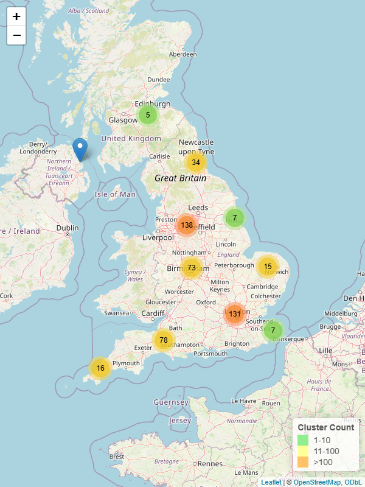

```{r setup}
#| message: false
library(tidyverse)
library(plotly)
library(scales)
library(DT)
library(waffle)

theme_set(theme_minimal(base_size = 24, base_family = "Atkinson Hyperlegible"))
```

```{r load}
# Read the cleaned dataset
data <- read.csv("data/final_dataset.csv")

# Organiser/volunteer type, derived from the tick-all-that-apply organising-role question
data <- data %>%
  rename(Organiser_Detail = Q17...How.have.you.been.involved.in.organising.folk.singing.events..Tick.all.that.apply) %>%
  mutate(
    Organiser_Type = case_when(
      is.na(Organiser_Detail) ~ "Non-organiser",
      str_detect(Organiser_Detail, regex("employed organiser", ignore_case = TRUE)) ~ "Professional",
      TRUE ~ "Volunteer"
    )
  )

# Broad age bands, used for demographic breakdowns (the full Age scale has 17
# sparse levels, too many to compare as a group of bars/colours)
data <- data %>%
  mutate(
    Age_Group = case_when(
      is.na(Age) ~ NA_character_,
      Age %in% c("18-19", "20-24", "25-29", "30-34", "35-39") ~ "Under 40",
      Age %in% c("40-44", "45-49", "50-54", "55-59") ~ "40-59",
      TRUE ~ "60+"
    )
  )

# One row per event type attended, for counting (Q2 is tick-all-that-apply)
events_long <- data %>%
  filter(!is.na(Q2...What.kinds.of.folk.singing.events.do.you.attend..Tick.all.that.apply...Selected.Choice)) %>%
  separate_rows(Q2...What.kinds.of.folk.singing.events.do.you.attend..Tick.all.that.apply...Selected.Choice, sep = ",") %>%
  rename(Event = Q2...What.kinds.of.folk.singing.events.do.you.attend..Tick.all.that.apply...Selected.Choice) %>%
  mutate(Event = ifelse(Event == "Other, please describe", "Other", Event)) %>%
  select(Respondent, Event, Age_Group, Ethnicity, Sexuality_clean, Organiser_Type)

# Shared colour palettes, reused across every demographic breakdown chart
party_colors <- c(
  "Conservative Party" = "#0087DC",
  "Green Party" = "#6AB023",
  "Labour Party" = "#E4003B",
  "Liberal Democrats" = "#FAA61A",
  "Other" = "#999999"
)
age_group_colors <- c("Under 40" = "#4C72B0", "40-59" = "#DD8452", "60+" = "#55A868")
ethnicity_colors <- c(
  "White British" = "#4C72B0", "White Other" = "#DD8452",
  "Any Other Ethnicity" = "#55A868", "Unknown" = "#8C8C8C"
)
sexuality_colors <- c(
  "Straight" = "#4C72B0", "Bisexual" = "#DD8452", "Gay/Lesbian" = "#55A868",
  "Queer" = "#C44E52", "Questioning" = "#8172B2", "Other" = "#8C8C8C"
)
organiser_colors <- c("Professional" = "#4C72B0", "Volunteer" = "#DD8452", "Non-organiser" = "#8C8C8C")

# Demographic lenses offered on the tabbed charts below (label -> column name + palette)
demographic_lenses <- list(
  "By Age" = list(col = "Age_Group", colors = age_group_colors),
  "By Ethnicity" = list(col = "Ethnicity", colors = ethnicity_colors),
  "By Sexuality" = list(col = "Sexuality_clean", colors = sexuality_colors),
  "By Organiser Type" = list(col = "Organiser_Type", colors = organiser_colors)
)

# Average political engagement, either overall by party, or broken down by one demographic
make_avg_chart <- function(group_col, colors) {
  df <- data %>%
    filter(!is.na(Political_engagement), !is.na(.data[[group_col]])) %>%
    group_by(.data[[group_col]]) %>%
    summarise(avg = mean(Political_engagement), .groups = "drop")

  plot_ly(
    x = df$avg,
    y = reorder(df[[group_col]], df$avg),
    type = "bar",
    orientation = "h",
    marker = list(color = colors[df[[group_col]]]),
    text = round(df$avg, 1),
    textposition = "auto"
  ) %>%
    layout(
      xaxis = list(title = "Average political engagement (0 = not engaged, 10 = very engaged)", range = c(0, 10)),
      yaxis = list(title = "")
    )
}

# Event-type counts, overall or broken down by one demographic
make_event_chart <- function(group_col = NULL, colors = NULL) {
  if (is.null(group_col)) {
    df <- events_long %>% count(Event, name = "n")
    plot_ly(
      x = df$n, y = reorder(df$Event, df$n), type = "bar", orientation = "h",
      marker = list(color = "#4C72B0"), text = df$n, textposition = "auto"
    ) %>%
      layout(xaxis = list(title = "Number of respondents"), yaxis = list(title = ""))
  } else {
    df <- events_long %>% filter(!is.na(.data[[group_col]])) %>% count(Event, .data[[group_col]], name = "n")
    plot_ly(
      x = df$n, y = df$Event, color = df[[group_col]], colors = colors,
      type = "bar", orientation = "h"
    ) %>%
      layout(barmode = "group", xaxis = list(title = "Number of respondents"), yaxis = list(title = ""))
  }
}

# One preference question's counts, overall or broken down by one demographic
make_pref_chart <- function(pref_col, group_col = NULL, colors = NULL, y_title = "", show_legend = TRUE) {
  if (is.null(group_col)) {
    df <- data %>% filter(!is.na(.data[[pref_col]])) %>% count(.data[[pref_col]], name = "n")
    plot_ly(
      x = df$n, y = reorder(df[[pref_col]], df$n), type = "bar", orientation = "h",
      marker = list(color = "#4C72B0")
    ) %>%
      layout(yaxis = list(title = y_title), xaxis = list(title = ""), showlegend = FALSE)
  } else {
    df <- data %>%
      filter(!is.na(.data[[pref_col]]), !is.na(.data[[group_col]])) %>%
      count(.data[[pref_col]], .data[[group_col]], name = "n")
    plot_ly(
      x = df$n, y = df[[pref_col]], color = df[[group_col]], colors = colors,
      type = "bar", orientation = "h"
    ) %>%
      layout(barmode = "group", yaxis = list(title = y_title), xaxis = list(title = ""), showlegend = show_legend)
  }
}
```

# Overview {orientation="columns"}

## Column {width="60%"}

```{r}
# Pre-calculate stats
num_males <- sum(data$Gender == "Male", na.rm = TRUE)
p_males <- num_males / sum(!is.na(data$Gender))
p_males_color <- "primary"

num_white <- sum(data$Ethnicity == "White British", na.rm = TRUE)
p_white <- num_white / sum(!is.na(data$Ethnicity))
p_white_color <- "success"


p_age_color <- "info"
age_60plus <- c("60-64", "65-69", "70-74", "75-79", "80-84", "85-89", "old", "Too old")
p_60plus <- sum(data$Age %in% age_60plus, na.rm = TRUE) / sum(!is.na(data$Age))


```


### Row {height="28%"}

```{r}
#| content: valuebox
#| title: "Male"
list(icon = "gender-male", color = p_males_color, value = label_percent(accuracy = 0.1)(p_males))
```

```{r}
#| content: valuebox
#| title: "White British"
list(icon = "globe-americas", color = p_white_color, value = label_percent(accuracy = 0.1)(p_white))
```

```{r}
#| content: valuebox
#| title: "Aged 60+"
list(
  icon = "graph-up-arrow",
  color = "warning",
  value = label_percent(accuracy = 0.1)(p_60plus)
)

```


### Row {height="72%" .tabset}


```{r}
#| title: Age Distribution


# Create frequency table
age_summary <- data %>%
  filter(!is.na(Age)) %>%
  count(Age) %>%
  mutate(Percentage = n / sum(n) * 100)

# Create percentage-based bar chart
age_percent_plot <- plot_ly(
  data = age_summary,
  x = ~Age,
  y = ~Percentage,
  type = "bar",
  marker = list(color = 'rgba(0, 123, 255, 0.7)')
) %>%
layout(
  xaxis = list(title = "Age", tickangle = 0),  # horizontal labels
  yaxis = list(title = "Percentage (%)", ticksuffix = "%"))

age_percent_plot


```

```{r}
#| title: Gender Chart
plot_ly(
  data = filter(data, !is.na(Gender)),
  labels = ~Gender, type = "pie", hole = 0.4,
  marker = list(colors = c("lightblue", "hotpink", "purple"))
)
```

```{r}
#| title: Age by Gender

age_gender_counts <- data %>%
  filter(!is.na(Age), !is.na(Gender)) %>%
  count(Age, Gender) %>%
  group_by(Age) %>%
  mutate(Percentage = n / sum(n) * 100)


age_hist_percent <- plot_ly(
  data = age_gender_counts,
  x = ~Age,
  y = ~Percentage,
  color = ~Gender,
  type = "bar"
) %>%
layout(
  barmode = "group",
  xaxis = list(title = "Age", tickangle = 0),  # horizontal labels
  yaxis = list(title = "Percentage (%)")
)

age_hist_percent

```

```{r}
#| title: Ethnicity
ethnicity_counts <- table(data$Ethnicity)
plot_ly(
  labels = names(ethnicity_counts),
  values = ethnicity_counts,
  type = "pie", hole = 0.5,
  textinfo = "percent"
)
```

```{r}
#| title: Sexual Orientation

# Count cleaned values
s <- table(data$Sexuality_clean)

# Create waffle chart
waffle(s, rows = 15, size = 0.5)

```

## Column {width="40%"}

{style="width:100%;height:100%;object-fit:contain;"}


# Political Engagement {orientation="rows"}

## Row {height="10%"}

```{r}
#| echo: false
cat("How politically engaged are folk singers? Compare by party, or pick a tab to see how engagement varies by age, ethnicity, sexuality, or organiser role.")
```

## Row {height="90%" .tabset}

```{r}
#| title: By Party
make_avg_chart("Political_party", party_colors)
```

```{r}
#| title: By Age
make_avg_chart(demographic_lenses[["By Age"]]$col, demographic_lenses[["By Age"]]$colors)
```

```{r}
#| title: By Ethnicity
make_avg_chart(demographic_lenses[["By Ethnicity"]]$col, demographic_lenses[["By Ethnicity"]]$colors)
```

```{r}
#| title: By Sexuality
make_avg_chart(demographic_lenses[["By Sexuality"]]$col, demographic_lenses[["By Sexuality"]]$colors)
```

```{r}
#| title: By Organiser Type
make_avg_chart(demographic_lenses[["By Organiser Type"]]$col, demographic_lenses[["By Organiser Type"]]$colors)
```

# Events Attended {orientation="rows"}

## Row {height="10%"}

```{r}
#| echo: false
cat("Which folk singing events do people attend most? Pick a tab to see how this varies by age, ethnicity, sexuality, or organiser role.")
```

## Row {height="90%" .tabset}

```{r}
#| title: Overall
make_event_chart()
```

```{r}
#| title: By Age
make_event_chart(demographic_lenses[["By Age"]]$col, demographic_lenses[["By Age"]]$colors)
```

```{r}
#| title: By Ethnicity
make_event_chart(demographic_lenses[["By Ethnicity"]]$col, demographic_lenses[["By Ethnicity"]]$colors)
```

```{r}
#| title: By Sexuality
make_event_chart(demographic_lenses[["By Sexuality"]]$col, demographic_lenses[["By Sexuality"]]$colors)
```

```{r}
#| title: By Organiser Type
make_event_chart(demographic_lenses[["By Organiser Type"]]$col, demographic_lenses[["By Organiser Type"]]$colors)
```

# Singing Preferences {orientation="rows"}

## Row {height="10%"}

```{r}
#| echo: false
cat("What do folk singers prefer when they perform? Pick a tab to see how this varies by age, ethnicity, sexuality, or organiser role.")
```

## Row {height="90%" .tabset}

```{r}
#| title: Overall
subplot(
  make_pref_chart("Microphone", y_title = "Microphone"),
  make_pref_chart("Standing", y_title = "Standing"),
  make_pref_chart("Instrument", y_title = "Instrument"),
  make_pref_chart("Word", y_title = "Words"),
  nrows = 2, margin = 0.1
)
```

```{r}
#| title: By Age
lens <- demographic_lenses[["By Age"]]
subplot(
  make_pref_chart("Microphone", lens$col, lens$colors, "Microphone", show_legend = TRUE),
  make_pref_chart("Standing", lens$col, lens$colors, "Standing", show_legend = FALSE),
  make_pref_chart("Instrument", lens$col, lens$colors, "Instrument", show_legend = FALSE),
  make_pref_chart("Word", lens$col, lens$colors, "Words", show_legend = FALSE),
  nrows = 2, margin = 0.1
)
```

```{r}
#| title: By Ethnicity
lens <- demographic_lenses[["By Ethnicity"]]
subplot(
  make_pref_chart("Microphone", lens$col, lens$colors, "Microphone", show_legend = TRUE),
  make_pref_chart("Standing", lens$col, lens$colors, "Standing", show_legend = FALSE),
  make_pref_chart("Instrument", lens$col, lens$colors, "Instrument", show_legend = FALSE),
  make_pref_chart("Word", lens$col, lens$colors, "Words", show_legend = FALSE),
  nrows = 2, margin = 0.1
)
```

```{r}
#| title: By Sexuality
lens <- demographic_lenses[["By Sexuality"]]
subplot(
  make_pref_chart("Microphone", lens$col, lens$colors, "Microphone", show_legend = TRUE),
  make_pref_chart("Standing", lens$col, lens$colors, "Standing", show_legend = FALSE),
  make_pref_chart("Instrument", lens$col, lens$colors, "Instrument", show_legend = FALSE),
  make_pref_chart("Word", lens$col, lens$colors, "Words", show_legend = FALSE),
  nrows = 2, margin = 0.1
)
```

```{r}
#| title: By Organiser Type
lens <- demographic_lenses[["By Organiser Type"]]
subplot(
  make_pref_chart("Microphone", lens$col, lens$colors, "Microphone", show_legend = TRUE),
  make_pref_chart("Standing", lens$col, lens$colors, "Standing", show_legend = FALSE),
  make_pref_chart("Instrument", lens$col, lens$colors, "Instrument", show_legend = FALSE),
  make_pref_chart("Word", lens$col, lens$colors, "Words", show_legend = FALSE),
  nrows = 2, margin = 0.1
)
```

